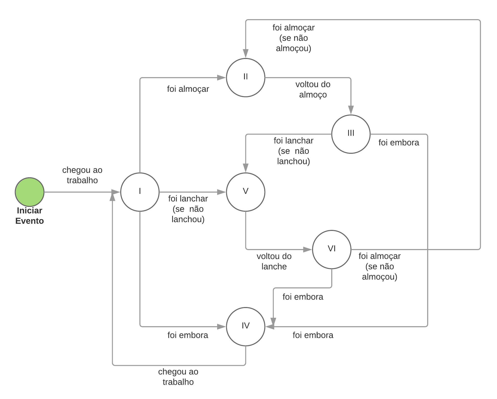
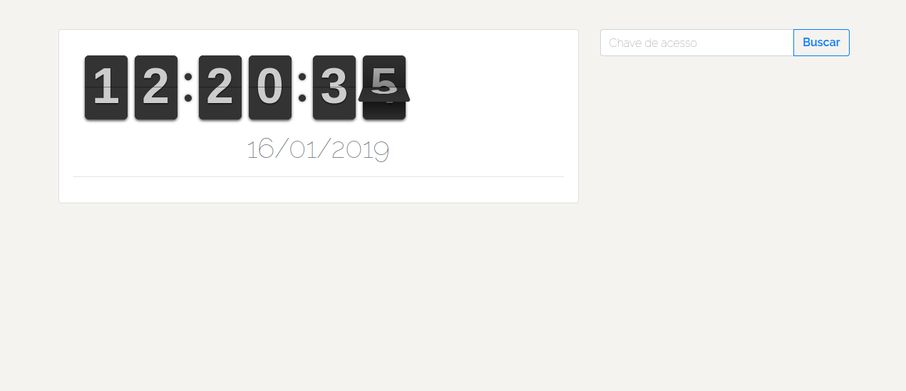
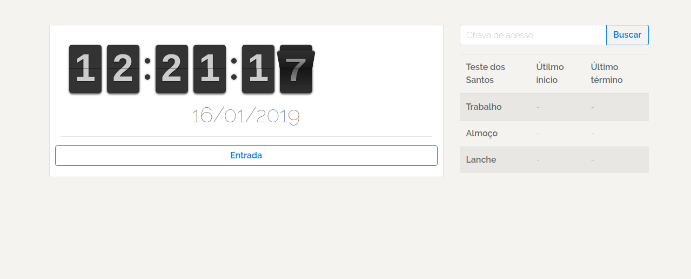
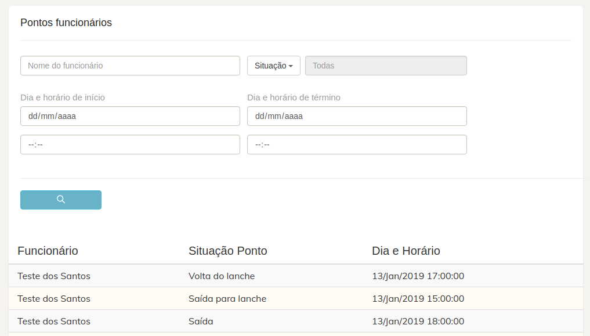
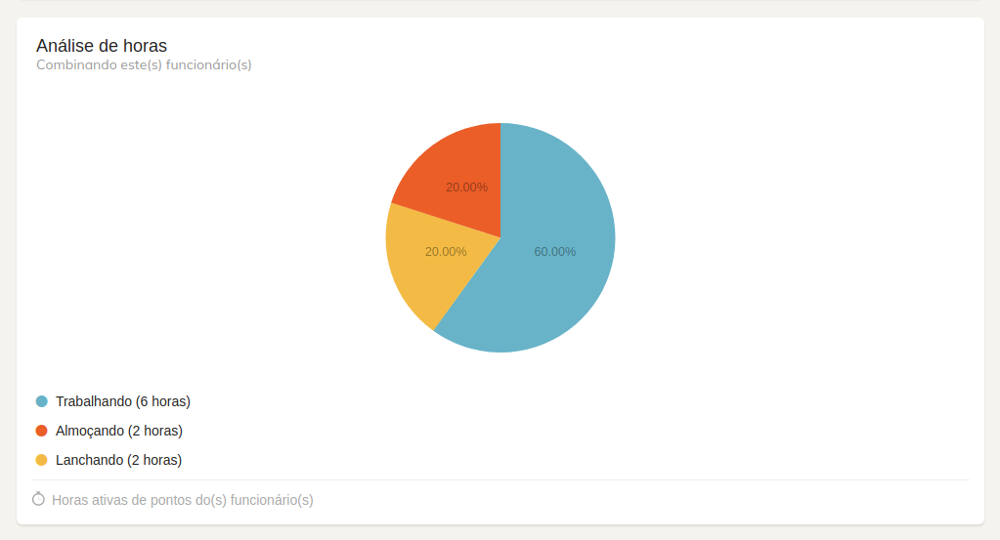
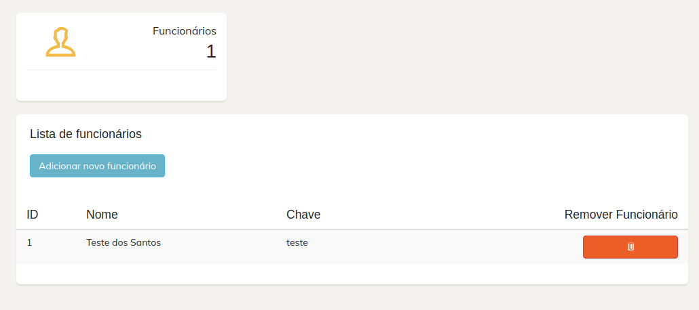
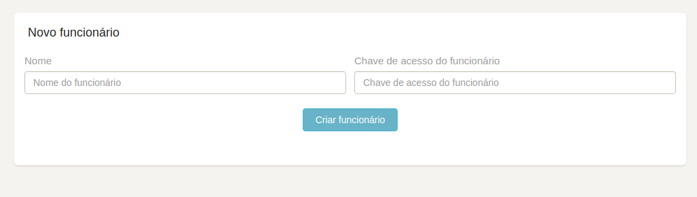

Máquina de bater ponto & Painel administrativo
========================================

Sistema web que simula uma máquina de bater ponto e um painel administrativo para cadastrar/remover funcionários e recuperar os registros de horário dos mesmos.

<!-- [](https://travis-ci.org/composer/composer) -->

Pré-requisitos / Tecnologias utilizadas
------------

- PHP >= 7.0.0 (versão 7.0.32 Recomendada para evitar potenciais <i>bugs</i>) [ver http://php.net/]
- Composer (versão 1.0.0-beta2 utilizada) [ver https://getcomposer.org/]
- SQLite <i>Database</i> [ver https://www.sqlite.org/index.html]
- Laravel 5.5 [ver https://laravel.com/docs/5.5/installation]
- FlipClock 0.8.0 Beta [ver http://flipclockjs.com/]
- Bootstrap (versões 4.2.1 e 3.3.7 utilizadas) [ver https://getbootstrap.com/]
- jQuery (versão 3.3.1 utilizada) [ver https://jquery.com/]
- Sweetalert [ver https://sweetalert.js.org/guides/]
- <i>Dashboard template</i> - Creative Tim [ver http://www.creative-tim.com]


Instalação / Inicialização
--------------------

Clone com o git ou baixe o projeto pelo https://github.com/

Caso tenha baixado o projeto pelo link, descompacte-o e vá para o passo 2

* <b>Passo 1</b> - Usando o git
```
$ git clone https://github.com/reposit.git ponto/
```
* <b>Passo 2</b>
```
$ cd ponto/
$ composer install
$ php artisan serve
```


Arquitetura / Lógica
--------

O banco de dados contem 3 tabelas: 
- ESTADO_PONTO - Contém todos os estados possíveis para o funcionário bater o ponto ('Entrar no trabalho', 'Ir almoçar', 'Voltar do almoço', 'Sair do trabalho', 'Ir lanchar' e 'Voltar do lanche')

- FUNCIONARIO - Contém todos os funcionários registrados no sistema juntamente com uma flag para marcar se o funcionário já almoçou e uma flag para marcar se o funcionário já foi lanchar 

- PONTO - registra os horários e estados dos funcionários quando eles batem o ponto

As ações no sistema de pontos foi baseada nesta sequência de estados: 


* I   - Trabalho
* II  - Sai almoço
* III - Volta almoço
* IV  - Embora
* V   - Sai lanche
* VI  - Volta lanche

Uso
-------

- <b>Sistema de bater ponto</b>

  O endereço para acessar esta página é a raiz (o primeiro endereço fornecido pelo comando para subir o site). A linha abaixo do comando em questão
  ```
  $ php artisan serve
  Laravel development server started: <http://127.0.0.1:8000>
  ```
  A tela inicial contém o campo para inserir sua chave de acesso (a chave é fornecida pelo administrador do sistema) e o relógio.
  

  Após inserir sua chave, aparecerá os estados possíveis para o registro e uma pequena tabela contendo os últimos registros do dia atual
  

- <b>Painel administrativo</b><br>
  
  O painel administrativo é acessado com o caminho '/admin'. Nela você poderá filtrar e ver os registros dos funcionários, juntamente com suas horas ativas
  
  

  Ainda no administrativo, você pode listar os funcionários, bem como adicionar um novo ou remover um existente
  
  

Próximas alterações
----------------

- Inserir lógica de login no painel administrativo
- Colocar toda lógica de horários no servidor
- Ajustar design das telas (ex.: unificação de estilos)
- Alterar banco de dados para um mais robusto